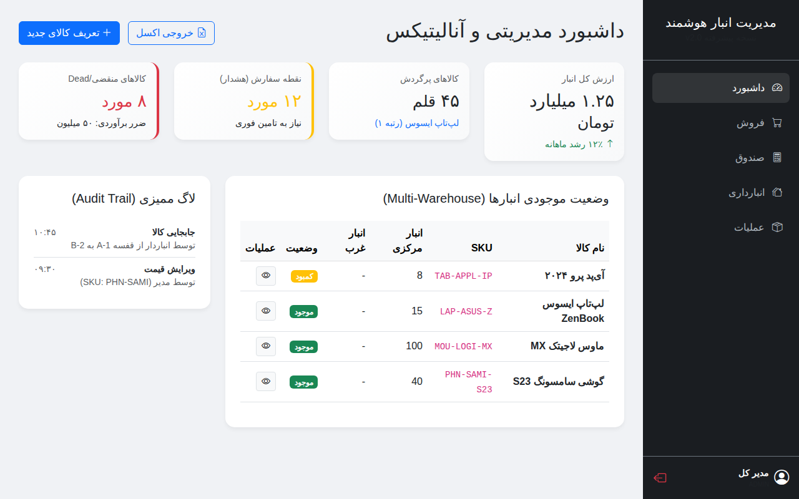
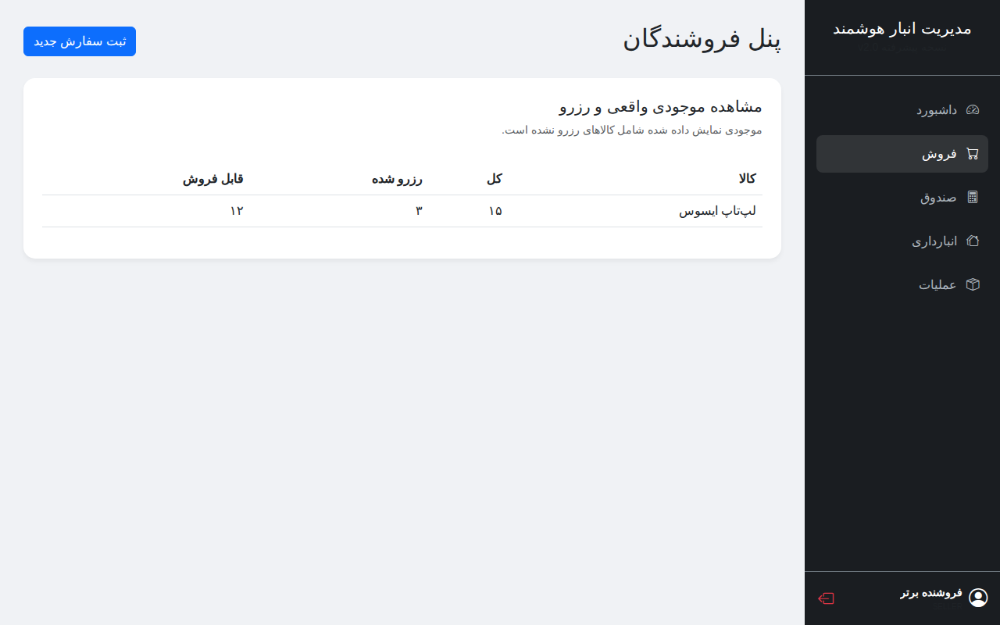
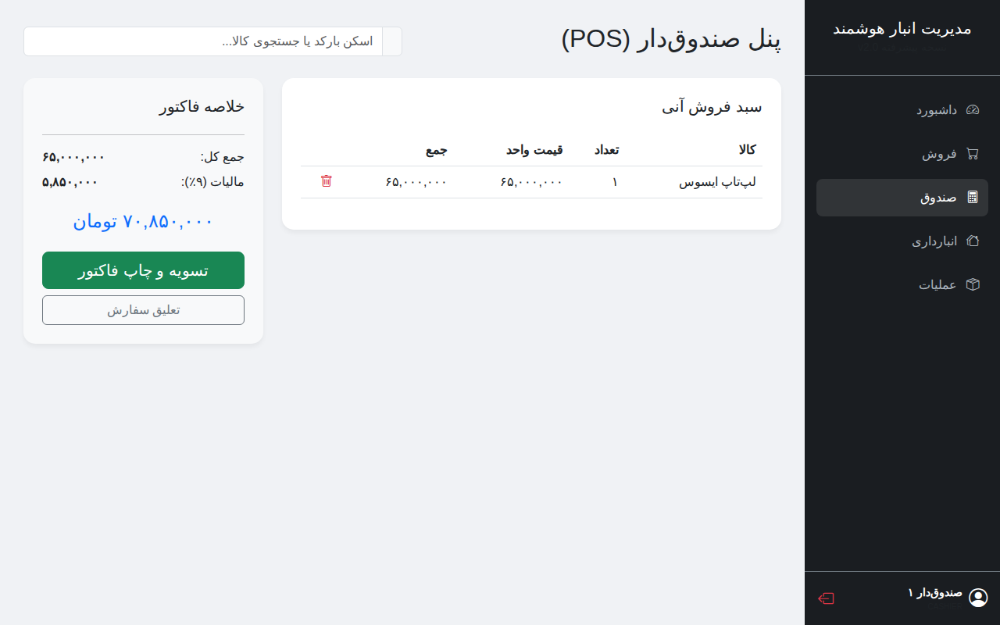
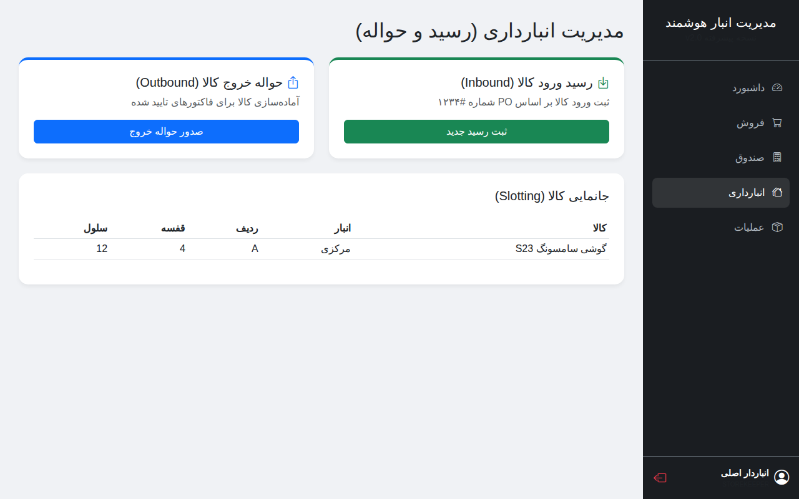
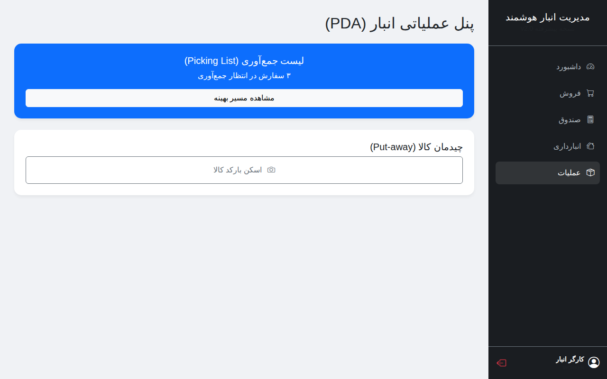

# سیستم پیشرفته و هوشمند مدیریت انبارداری (Advanced Smart Inventory) 📦

این پروژه یک راهکار جامع و صنعتی برای مدیریت دیجیتال انبار، فروش، صندوق و تدارکات است که با معماری پاک (Clean Architecture) پیاده‌سازی شده است.

## 🚀 قابلیت‌های کلیدی و نقش‌های کاربری (RBAC)

### ۱. مدیر کل (Admin) - داشبورد آنالیتیکس
- **مشاهده لحظه‌ای ارزش انبار:** محاسبه اتوماتیک ارزش ریالی کالاها.
- **نمودارها و گزارشات:** شناسایی کالاهای پرفروش و کم‌گردش (Dead Stock).
- **مدیریت چندانباره:** کنترل موجودی در انبار مرکزی و شعبه‌ها.


### ۲. فروشنده (Seller) - ثبت سفارش
- **صدور پیش‌فاکتور:** رزرو موقت کالا برای مشتریان.
- **موجودی واقعی:** تفکیک موجودی کل از موجودی رزرو شده.


### ۳. صندوق‌دار (Cashier) - پایانه فروش (POS)
- **فروش سریع:** بهینه‌سازی شده برای مانیتورهای لمسی و بارکدخوان.
- **تسویه حساب:** محاسبه مالیات و صدور فاکتور نهایی.


### ۴. انباردار (Storekeeper) - رسید و حواله
- **جانمایی کالا (Slotting):** مدیریت دقیق آدرس کالا (ردیف، قفسه، سلول).
- **انبارگردانی:** ثبت مغایرت‌های موجودی به صورت دیجیتال.


### ۵. کارگر انبار (Worker) - عملیات PDA
- **Picking & Packing:** مسیر یابی هوشمند برای جمع‌آوری کالا.
- **اسکن بارکد:** تایید چیدمان و خروج کالا با اسکنر.


---

## 💡 ویژگی‌های فنی پیشرفته
- **ردیابی بچ و سریال (Batch/Serial):** مناسب برای صنایع دارویی و قطعات الکترونیک.
- **Audit Trail:** ثبت تمامی عملیات‌ها با جزییات دقیق زمان و کاربر.
- **کنترل کیفیت (QC):** قرنطینه خودکار کالاهای ورودی تا تایید نهایی.

---

## 🏗 نصب و راه‌اندازی

۱. نصب کتابخانه‌ها:
```bash
pip install -r requirements.txt
```

۲. مقداردهی اولیه داده‌ها (Seed):
```bash
PYTHONPATH=. python3 scripts/seed_data.py
```

۳. اجرای برنامه:
```bash
uvicorn app.main:app --reload
```

---
*طراحی شده با FastAPI، Bootstrap 5 (RTL) و فونت وزیرمتن.*
