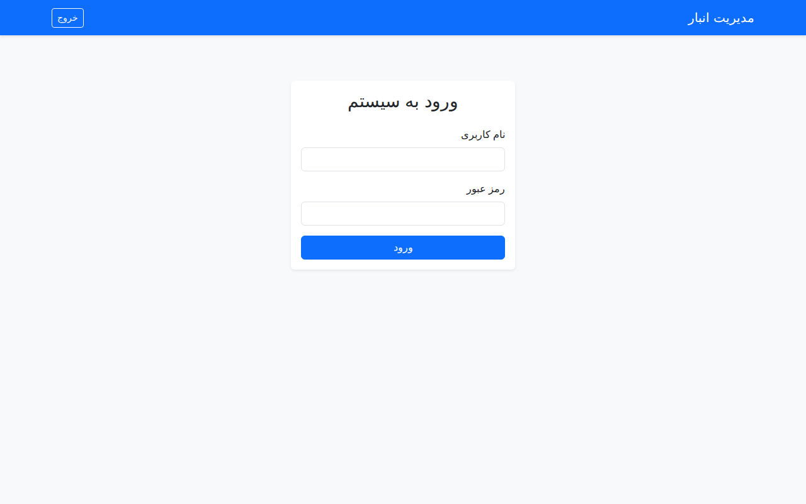

# سیستم مدیریت هوشمند انبار 📦 | Smart Inventory Management System

[English Version Below](#english-version)

این یک سیستم مدیریت انبار مدرن و مقیاس‌پذیر است که با استفاده از **FastAPI**، **PostgreSQL** (در محیط توسعه SQLite) و **Redis** ساخته شده است. این برنامه دارای رابط کاربری وب فارسی و سیستم کنترل دسترسی بر اساس نقش (RBAC) می‌باشد.

## ✨ ویژگی‌های کلیدی

### ۱. رابط کاربری وب حرفه‌ای 🎨
دارای سه پنل مجزا برای کاربران مختلف با استفاده از فونت زیبای **وزیرمتن** و **بوت‌استرپ ۵**:
- **پنل مدیر**: مدیریت کامل محصولات و مشاهده گزارش‌ها.
- **پنل فروشنده**: ثبت سریع فروش و مرجوعی کالا.
- **پنل انباردار**: ثبت شمارش کالا و اصلاح موجودی (Adjustment).

### ۲. امنیت و سطوح دسترسی (RBAC) 🔐
دسترسی‌ها به دقت بر اساس نقش کاربر محدود شده است تا امنیت داده‌ها حفظ شود.

### ۳. کنترل همزمانی (Optimistic Locking) 🔒
استفاده از سیستم نسخه گذاری برای جلوگیری از تداخل در به‌روزرسانی موجودی توسط چندین کاربر به صورت همزمان.

### ۴. معماری پاک (Clean Architecture) 🏗️
جداسازی لایه‌های منطق تجاری، دسترسی به داده‌ها و ارائه برای نگهداری آسان‌تر.

---

## 📸 اسکرین‌شات‌ها

### ۱. صفحه ورود (Login)


### ۲. پنل مدیریت (Manager Panel)


### ۳. پنل فروشنده (Seller Panel)


### ۴. پنل انباردار (Worker Panel)


---

## 🚀 راه اندازی

۱. نصب وابستگی‌ها:
```bash
pip install -r requirements.txt
```

۲. آماده‌سازی دیتابیس و داده‌های تستی (Persian Seed):
```bash
PYTHONPATH=. python3 scripts/seed_data.py
```

۳. اجرای برنامه:
```bash
uvicorn app.main:app --reload
```

---

<a name="english-version"></a>
# Smart Inventory Management System 📦

A modern, scalable inventory system built with **FastAPI**, **PostgreSQL**, and **Redis**. Featuring a dedicated Persian Web UI and Role-Based Access Control (RBAC).

## ✨ Key Features

- **Multi-Role Web UI**: Dedicated panels for Manager, Seller, and Warehouse Worker.
- **RBAC**: Secure endpoints and UI elements based on user roles.
- **Optimistic Locking**: Prevents race conditions during stock updates.
- **Persian Support**: Full support for Persian language and Vazirmatn font.
- **API Documentation**: Comprehensive documentation in `README_API.md`.

## 🛠️ Tech Stack
- **Backend**: FastAPI (Python)
- **Database**: SQLAlchemy, SQLite (Development), PostgreSQL (Production ready)
- **Frontend**: HTML5, CSS3 (Bootstrap 5), JavaScript
- **Auth**: JWT (JSON Web Tokens)
